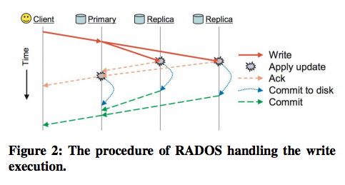

# A Weak Consistency Model For Ceph
- [related link](http://ieeexplore.ieee.org/stamp/stamp.jsp?tp=&arnumber=7823769)

<br>

### Abstract
- **The primary-copy consistency model used in Ceph**
  - cannot satisfy the low latency requirement of write operation required by users
- **propose a weak consistency model, PROAR**
  - a distributed hash ring mechanism to allow clients to only commit data to the primary node
  - synchronize data to replication nodes asynchronously in Cepj
  - Based on the distributed hash ring mechanism, the low latency requirement of write operation can be met.


<br>


### Introduction
- The main issue of data replications
  - how to synchronize replications to the same state when one of them has been modified
  - `strong consistency model` the replication process must ensure all replications are at the same state before any other file operations can be processed
    - primary-copy
    - chain
    - will result in a high latency of write operations.
  - ` weak consistency models`  the replication process is completed when one of the replication is updated and other file operations can be proceeded.
    - Dynamo
    - Cassandra
    - PNUTS
    - Bayou
- **Introducing PROAR**
  - PROAR can reduce about 50% write overhead compared to that of Ceph
  - has a more balanced workload around all the replication nodes


<br>


### Related works

- **Customized consistency model.**
  - When clients write data to servers, system only commits data to N/2 servers, where N is the number of replication
  - Furthermore, when clients read data from servers, system only chooses the closest sever that contains the data as the read replica sever
  - The data in the selected server may be out-of-dated.

- **Ceph consistency model.**
  - the primary node executes each client operation in serialization
  - informs the replication nodes to execute this operation as the orders of primary node
  - After all the replications are executed successfully, the primary node returns client the successful response code.


- **ceph overview**
  - each object stored by the system is first mapped into a placement group
  - PGs are allocated to object storage devices (OSDs) based on `CRUSH algorithm`
    - a robust replica distribution algorithm that calculates a stable and pseudo-random mapping
    - PGs are assigned to OSDs based on the cluster map,
    - PGs are distributed deterministically but pseudo-randomly
    - When one (or many) of devices join or leave the cluster, most PGs remain where they are and only small amount of data are shifted to maintain a balanced distribution
    - uses weights to control the relative amount of data assigned to each device based on its capacity and loading.


<br>

- **primary-copy consistency model**
  1. When a client writes an object to Ceph
  2. the client will first hash the object into a PG
  3. client sends a message to the monitor cluster to get the current cluster map,
    -  CRUSH algorithm is used to calculate all the OSDs of the PG.
  4. client directly sends data to the primary role OSD
    - the primary role OSD does not responds client with ack until all replicas have been committed to disk.
  - `all the operations of the same object will be directed to the same primary role OSD`



<br>


### PROAR CONSISTENCY MODEL
**avoid the disadvantages of primary-copy algorithm**
-  propose a weak consistency model called PROAR (Primary Role Hash Ring
    - PROAR builds a primary role hash ring after PG getting all the OSDs via CRUSH algorithm
    - PROAR only commits data to the primary role OSD and responses client with the result of commit
-  PROAR stores logs of all the replication role OSDs of the PG  
  - ensure the primary node and replication nodes at the same state when system converges
  - can be used for the recovery of down OSD.


<br>


**Primary role hash ring**
- OSDs of a PG are hashed into a 32-bit space circle
- They will play as the primary role OSDs of those objects between them in the primary hash ring.
- there are three replication OSDs of all the objects in a PG
- osd.1 is the primary role OSD of objects between PROARHash(osd. 3) and PROARHash(osd.1) in the primary role hash ring
- PROARHash is a function to get the hash values of OSDs in the primary role hash ring.
- S1 is the scope in between PROARHash(osd.3) and PROARHash(osd.1)
- all the operations of objects in the PG will be dispatched to the 3 primary role OSDs based on the hashing of object

<br>

### PROARHash
- the input is CRUSHArray that is obtained by using the CRUSH algorithm
- output is HashArray.

```
// 1 Get the hash value of OSDs


```
