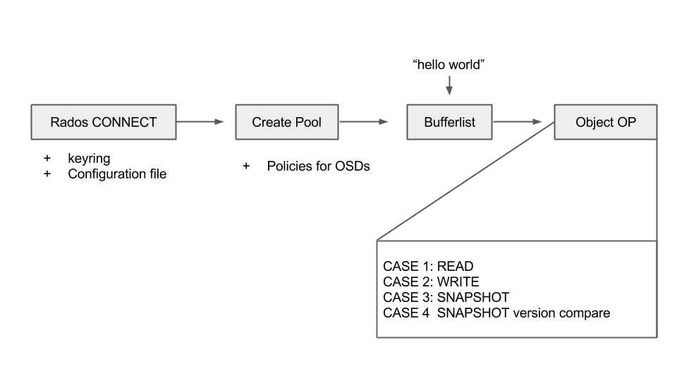
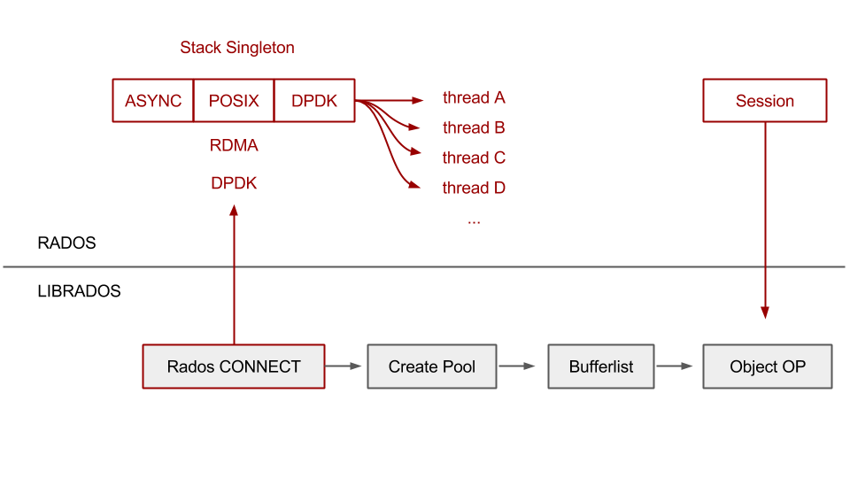

# Ceph-Experiment

### Contents
1. [Network Basics](/network-basic)
2. [Deploy Ceph](/ceph-deploy)
3. [Messenger Mechanism](/messenger)
4. [GDB Experiments](/gdb-Experiment)

 

### Abstract

1. **Dummy Application for Read and Write**
    - Used for testing 4 cases of message passing  
    - Multiple threads run the same R/W operations
    - Used GDB to track down the functions of Librados

 

2. **Message Passing Used by Ceph**
    - Uses Singleton Message Stack as the protocol template
    - The stack is passed on to the Threads for running RW ( Asynchronous mode )

 

3. **Implemented Structure**
    - used virtual box
    - three virtual os served as monitor and two osds
    - used bluestore

