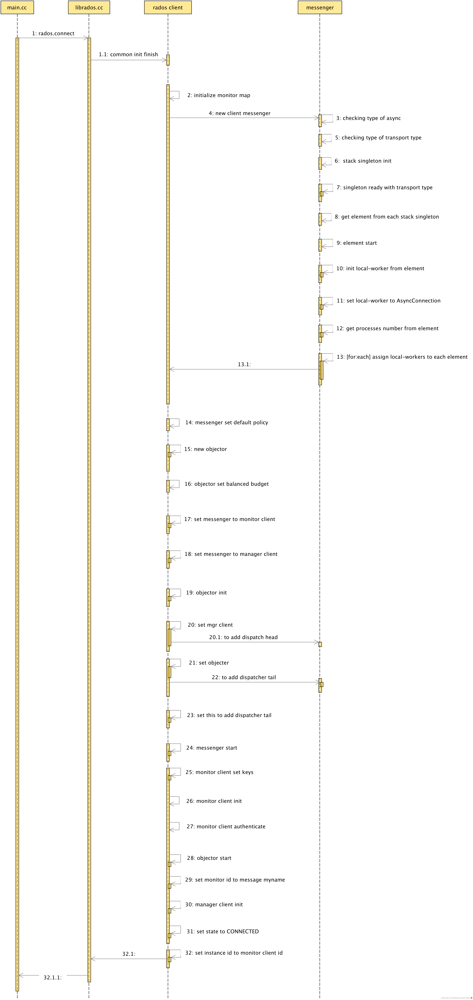
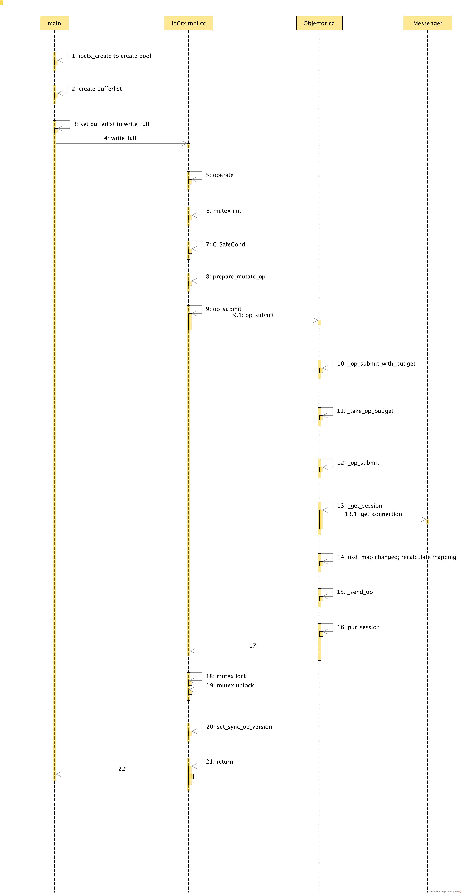

### CONTENTS of src/msg/async
  - [x] CRUD commands for pools
  - [x] The definition of pools in Ceph
  - [x] CRUD commands for data objects  
  - [x] know the basic CRUD of LIBRADOS
  - [x] create a sample code  that will create a file and then delete a file in a pool
  - [x] debug it by debugging the /var/msg/async   
  - [ ] Finding a way to debug outside of librados scope

<br>

### Features of Pools
  - Resilience: You can set how many OSD are allowed to fail without losing data. For replicated pools, it is the desired number of copies/replicas of an object. A typical configuration stores an object and one additional copy (i.e., size = 2), but you can determine the number of copies/replicas. For erasure coded pools, it is the number of coding chunks (i.e. m=2 in the erasure code profile)

  <br>

  - Placement Groups: You can set the number of placement groups for the pool. A typical configuration uses approximately 100 placement groups per OSD to provide optimal balancing without using up too many computing resources. When setting up multiple pools, be careful to ensure you set a reasonable number of placement groups for both the pool and the cluster as a whole.
CRUSH Rules: When you store data in a pool, a CRUSH ruleset mapped to the pool enables CRUSH to identify a rule for the placement of the object and its replicas (or chunks for erasure coded pools) in your cluster. You can create a custom CRUSH rule for your pool.

<br>

  - Snapshots: When you create snapshots with ceph osd pool mksnap, you effectively take a snapshot of a particular pool.
Set Ownership: You can set a user ID as the owner of a pool.

<br>

### CRUD commands for pools
  1. **creating pool**
```
// for some reason directly creating the pool from rados fails

$ ceph osd pool create {pool-name} {pg-num} [{pgp-num}]
$ ceph osd lspools
$ rados df // available to check the file from here
```

  2. **renamng pool**
```
ceph osd pool rename {current-pool-name} {new-pool-name}
```

  3. **removing pool**
```
// need to set the mon_allow_pool_delete config option to true
```

  4. **pool snapshot**
```
$ ceph osd pool mksnap {pool-name} {snap-name}
$ ceph osd pool rmsnap {pool-name} {snap-name} //this will remove the snapshot from that pool
```


<br>


### CRUD commands for data objects  

  1. **CREATE object**

```
rados -p {pool-name} put myobject blah.txt
```
  2. **RETREIVE objects**
```
rados -p foo ls -
```
  3. **DELETE objects**
```
rados -p foo rm myobject
```
  4. **SNAPSHOT objects**
```
// ignored due to other pending issues with higher priority
```


<br>


### Running LIBRADOS
- [link to running librados example](librados_Experiment)
- must add pool with the command below
```
$ ceph osd pool create {pool-name} {pg-num} [{pgp-num}]
$ ceph osd lspools
$ rados df // available to check the file from here
```
- avoid creating pools directly from the code for it causes errors at this point


<br>

### SAMPLE WRITE READ FILE
- [link to running sample application](sample_application)
- [Debug Path of read and write](debugging_files/)

<br>



